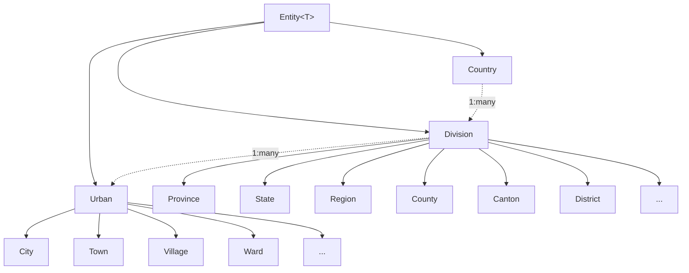

# Project Architecture Overview

## Solution Structure

The Nation library follows a clean, Domain-Driven Design architecture with a clear separation of concerns and well-defined boundaries.

### Project Layout

```
Nation/
├── src/                           # Main library source code
│   ├── Countries/                 # Country entities and configurations
│   ├── Divisions/                 # Administrative division entities
│   ├── Domain/                    # Core domain foundation
│   ├── Seeds/                     # Seed data for geographical entities
│   ├── Urbans/                    # Urban area entities
│   └── Wangkanai.Nation.csproj    # Main library project file
├── test/                          # Test project
│   ├── MockTests.cs               # Test implementations
│   └── Wangkanai.Nation.Tests.csproj
├── benchmark/                     # Performance benchmarking
│   ├── Program.cs                 # Benchmark entry point
│   └── Wangkanai.Nation.Benchmark.csproj
├── docs/                          # Documentation (generated)
├── Assets/                        # Visual assets and branding
├── Directory.Build.props          # Global build properties
├── Directory.Packages.props       # Centralized package management
└── Nation.slnx                   # Visual Studio solution file
```

### Build System Architecture

#### Global Configuration

The build system uses MSBuild Directory.Build.props for consistent configuration across all projects:

```xml
<Project>
  <!-- Target Framework: .NET 9.0 -->
  <PropertyGroup>
    <TargetFramework>net9.0</TargetFramework>
    <LangVersion>latest</LangVersion>
    <Nullable>enable</Nullable>
    <ImplicitUsings>enable</ImplicitUsings>
  </PropertyGroup>

  <!-- Package Metadata -->
  <PropertyGroup>
    <VersionPrefix>1.0.0</VersionPrefix>
    <Title>Wangkanai Nation</Title>
    <PackageTags>nation;country;entity;domain;ddd</PackageTags>
    <Description>Nation: Seed your dataset with actual country data</Description>
  </PropertyGroup>
</Project>
```

#### Central Package Management (CPM)

Uses Directory.Packages.props for centralized dependency management:

```xml
<ItemGroup>
  <!--Entity Framework-->
  <PackageVersion Include="Microsoft.EntityFrameworkCore" Version="9.0.0"/>
  <PackageVersion Include="Microsoft.EntityFrameworkCore.Relational" Version="9.0.0"/>
  
  <!--Testing-->
  <PackageVersion Include="xunit" Version="2.9.0"/>
  <PackageVersion Include="Microsoft.NET.Test.Sdk" Version="17.11.1"/>
  
  <!--Benchmarking--> 
  <PackageVersion Include="BenchmarkDotNet" Version="0.14.0"/>
</ItemGroup>
```

### Dependencies and Technology Stack

#### Core Dependencies

| Dependency | Version | Purpose |
|------------|---------|---------|
| .NET | 9.0 | Runtime platform |
| Microsoft.EntityFrameworkCore | 9.0.0 | ORM and database abstraction |
| Microsoft.EntityFrameworkCore.Relational | 9.0.0 | Relational database support |
| Microsoft.Extensions.Identity.Stores | 9.0.0 | Identity integration support |
| JetBrains.Annotations | 2024.2.0 | Code analysis annotations |

#### Development Dependencies

| Dependency | Version | Purpose |
|------------|---------|---------|
| Microsoft.SourceLink.GitHub | 8.0.0 | Source linking for debugging |
| xunit | 2.9.0 | Testing framework |
| xunit.runner.visualstudio | 2.8.2 | Visual Studio test integration |
| coverlet.collector | 6.0.2 | Code coverage collection |
| BenchmarkDotNet | 0.14.0 | Performance benchmarking |

## Domain Architecture

### Core Domain Layer

The foundation of the system is built on a generic entity pattern following DDD principles:

```csharp
namespace Wangkanai.Domain
{
    // Contract for all entities
    public interface IEntity<T> where T : IComparable<T>, IEquatable<T>
    {
        T Id { get; set; }
        bool IsTransient();
    }

    // Base implementation providing identity and equality
    public abstract class Entity<T> : IEntity<T> where T : IEquatable<T>, IComparable<T>
    {
        public T Id { get; set; }
        public bool IsTransient() => Id.Equals(default);
        // + Equality operations, hash code generation
    }
}
```

### Geographical Domain Model

#### Three-Tier Hierarchy



#### Entity Design Patterns

1. **Sealed Root Aggregates**: `Country` is sealed, representing complete sovereignty
2. **Abstract Hierarchies**: `Division` and `Urban` are abstract bases for specialization
3. **Concrete Implementations**: Specific geographical types inherit from abstract bases
4. **Value Objects**: ISO codes, names, and populations as value properties

### Data Access Layer

#### Entity Framework Configuration Strategy

The system uses dedicated configuration classes following the IEntityTypeConfiguration pattern:

```csharp
// Country configuration with seed data
public sealed class CountryConfiguration : IEntityTypeConfiguration<Country>
{
    public void Configure(EntityTypeBuilder<Country> builder)
    {
        // Property constraints
        builder.Property(x => x.Iso).HasMaxLength(2).IsRequired();
        builder.Property(x => x.Name).HasMaxLength(100).IsRequired();
        builder.Property(x => x.Native).HasMaxLength(100).IsUnicode().IsRequired();
        
        // Seed data integration
        builder.HasData(CountrySeed.Dataset);
    }
}
```

#### Table-Per-Hierarchy (TPH) Strategy

Both Division and Urban hierarchies use TPH inheritance mapping:

```csharp
// Division hierarchy configuration
builder.HasDiscriminator<string>("type")
    .HasValue<Province>("Province")
    .HasValue<State>("State")
    .HasValue<Region>("Region");
    // ... other division types
```

**Benefits:**
- Single table queries for better performance
- Simple schema with no complex joins
- Easy extensibility for new geographical types

**Trade-offs:**
- Some nullable columns for type-specific properties
- Larger single tables instead of normalized structure

## Data Seeding Architecture

### Seed Data Strategy

The library implements a structured approach to seed data management:

#### Built-in Seed Data

```csharp
namespace Wangkanai.Nation.Seeds
{
    // Base country dataset
    internal static class CountrySeed
    {
        internal static List<Country> Dataset = 
        [
            new(66, "TH", 66, "Thailand", "ไทย", 71_652_176)
        ];
    }
}

namespace Wangkanai.Nation.Seeds.Thailand
{
    // Country-specific division data
    public static class ProvinceSeed
    {
        public static List<Province> Dataset =
        [
            new(66, 66_0001, "BKK", "Bangkok", "กรุงเทพมหานคร", 5_692_284)
        ];
    }
}
```

#### Extensibility Patterns

1. **Country-Specific Namespaces**: Seeds organized by country (`Seeds.Thailand`, `Seeds.UnitedStates`)
2. **Type-Specific Collections**: Separate datasets for different entity types
3. **Lazy Loading**: Seed data loaded only when accessed
4. **Immutable Datasets**: Seed data as readonly collections

## Build and Deployment Architecture

### Build Pipeline

#### PowerShell Build Script (`build.ps1`)

```powershell
# Automated build pipeline
dotnet restore                    # Restore NuGet packages
dotnet build -c Release         # Build in Release configuration  
dotnet test -c Release          # Run all tests
# Optional: dotnet pack for NuGet package creation
```

#### Continuous Integration

**GitHub Actions Workflow** (`.github/workflows/dotnet.yml`):
- Multi-target framework builds (.NET 8.0, 9.0)
- Cross-platform testing (Windows, Linux, macOS)
- SonarCloud static analysis integration
- Automated NuGet package publishing

### Package Architecture

#### NuGet Package Structure

```
Wangkanai.Nation.nupkg
├── lib/
│   └── net9.0/
│       └── Wangkanai.Nation.dll
├── README.md                    # Package documentation
├── wangkanai-logo.png          # Package icon
└── LICENSE                     # Apache 2.0 license
```

#### Package Metadata

- **Package ID**: `Wangkanai.Nation`
- **Target Framework**: .NET 9.0
- **License**: Apache 2.0
- **Tags**: nation, country, entity, domain, ddd
- **Source Link**: GitHub integration for debugging

## Performance and Scalability Architecture

### Entity Framework Optimizations

#### Index Strategy

```csharp
// Primary keys: Clustered indexes (automatic)
// Foreign keys: Non-clustered indexes for join performance
builder.HasIndex(u => u.DivisionId);

// ISO codes: Lookup performance
builder.HasIndex(u => u.Iso);

// Unique constraints: Data integrity
builder.HasIndex(c => c.Iso).IsUnique();
```

#### Query Patterns

1. **Type-Specific Queries**: Use `OfType<T>()` for TPH filtering
2. **Projection Queries**: Select only required columns
3. **Batched Operations**: Process large datasets in chunks
4. **Caching Strategy**: Cache frequently accessed reference data

### Memory Management

#### Entity Lifecycle

1. **Transient Entities**: Detected via `IsTransient()` method
2. **Attached Entities**: Tracked by Entity Framework change tracker
3. **Detached Entities**: For DTOs and cross-boundary transfers
4. **Immutable Seed Data**: Static datasets with minimal memory footprint

## Testing Architecture

### Testing Strategy

#### Test Organization

```csharp
namespace Wangkanai.Nation.Tests
{
    // Current: Placeholder tests
    public class MockTests
    {
        [Fact]
        public void MockTest() { /* Basic test structure */ }
    }
    
    // Future: Comprehensive test suites
    // - Unit tests for entities and domain logic
    // - Integration tests for EF Core configurations  
    // - Performance tests for large datasets
}
```

#### Test Categories

1. **Unit Tests**: Entity behavior, equality operations, validation logic
2. **Integration Tests**: Database operations, seed data loading, EF configurations
3. **Performance Tests**: Large dataset operations, query performance, memory usage
4. **Benchmark Tests**: BenchmarkDotNet for performance measurements

### Quality Assurance

#### Static Analysis

- **SonarCloud**: Code quality, security vulnerabilities, maintainability
- **Compiler Warnings**: Treated as errors (except specific exemptions)
- **Nullable Reference Types**: Enabled throughout codebase
- **Code Coverage**: Coverlet collector integration

## Security Architecture

### Security Considerations

#### Data Validation

1. **Input Sanitization**: ISO codes, names, and population values
2. **Length Constraints**: Database field length enforcement  
3. **Type Safety**: Strong typing prevents data corruption
4. **Foreign Key Constraints**: Referential integrity enforcement

#### Access Control

1. **Read-Only Seed Data**: Immutable reference datasets
2. **Entity Framework Security**: Parameterized queries prevent SQL injection
3. **Package Integrity**: SourceLink and signed assemblies

## Extensibility Architecture

### Extension Points

#### Adding New Geographical Types

1. **Division Types**: Inherit from `Division` abstract class
2. **Urban Types**: Inherit from `Urban` abstract class  
3. **Custom Properties**: Add type-specific properties as needed
4. **EF Configuration**: Optional custom configuration classes

#### Custom Seed Data

1. **Country-Specific Seeds**: Create new seed classes in appropriate namespaces
2. **Data Source Integration**: Support for JSON, CSV, API data sources
3. **Migration Scripts**: Database seeding and migration strategies

### Future Architecture Considerations

#### Planned Enhancements

1. **Navigation Properties**: Full EF Core relationship mapping
2. **Expanded Seed Data**: Comprehensive global datasets
3. **Spatial Data Support**: Coordinate and boundary information
4. **Localization**: Multi-language support beyond native names
5. **Historical Data**: Time-series support for changing boundaries
6. **REST API**: Optional API layer for geographical data access

#### Architectural Decisions for Scale

1. **Microservice Ready**: Clean boundaries for service decomposition
2. **Cloud Native**: Compatible with cloud deployment patterns
3. **Database Agnostic**: Support for multiple database providers
4. **Caching Strategy**: Ready for Redis/memory caching integration

This architecture provides a solid foundation for geographical data management while maintaining flexibility for future enhancements and scale requirements.